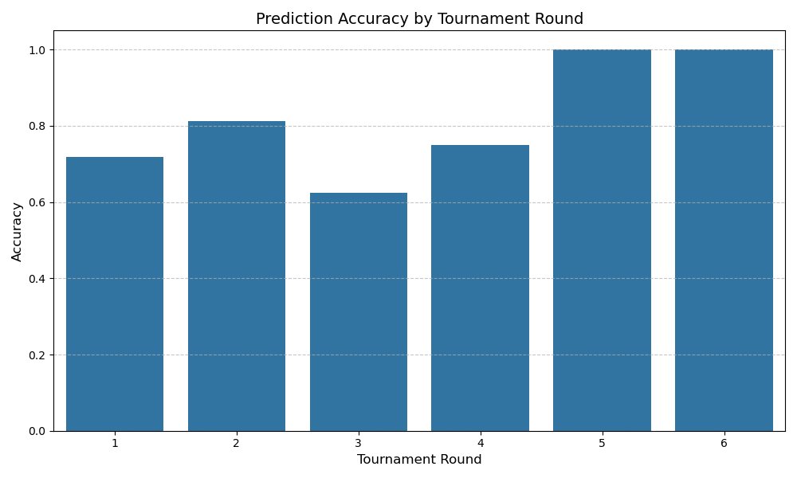
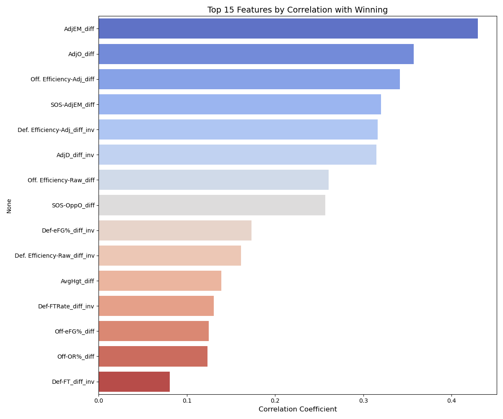
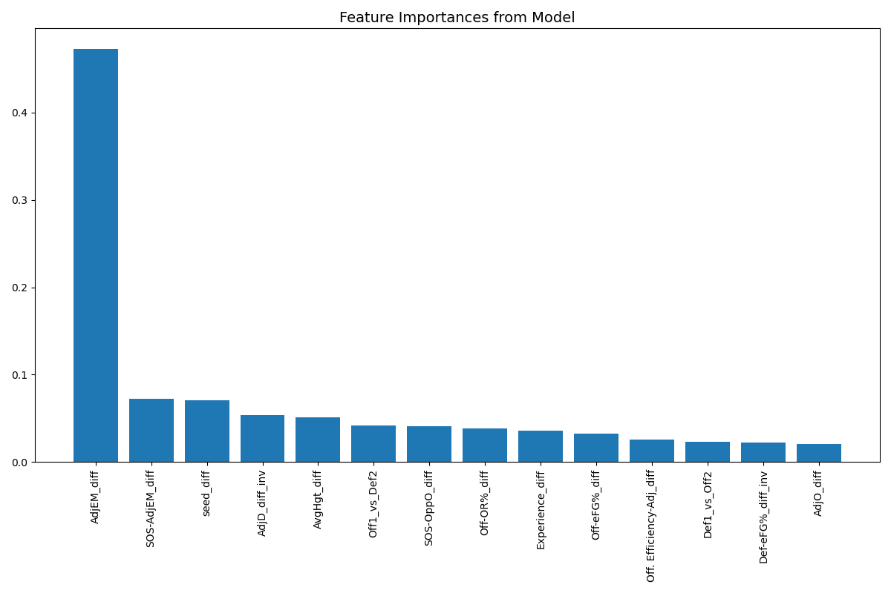
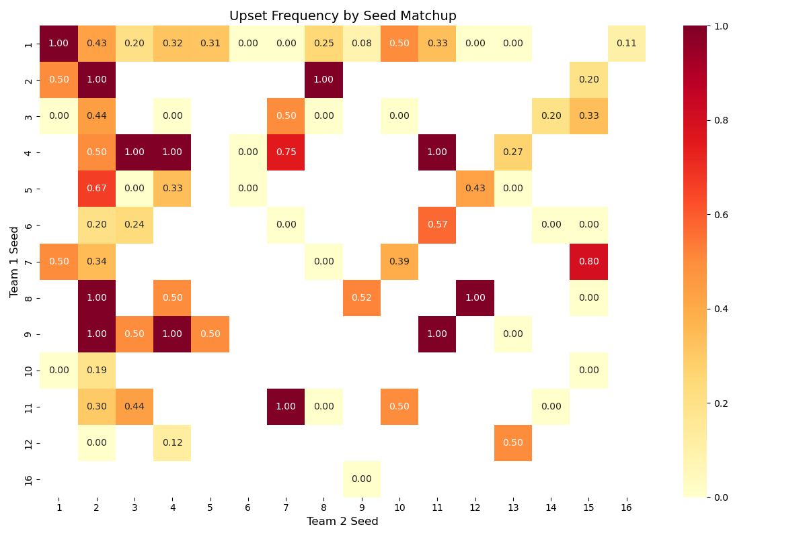
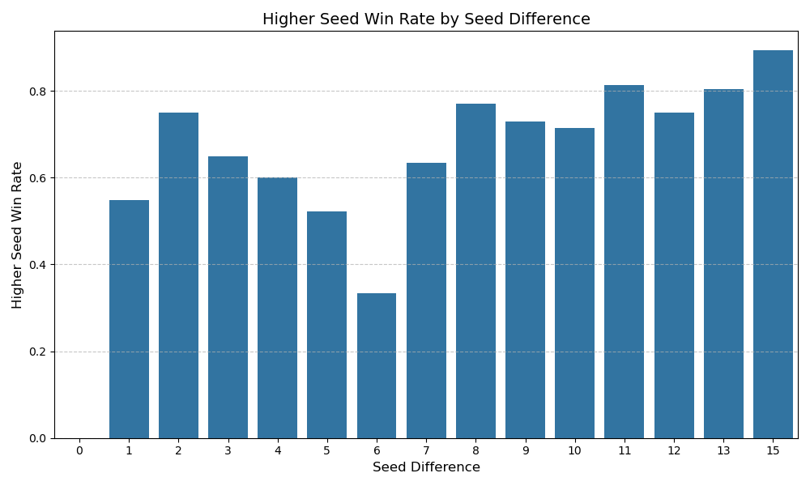
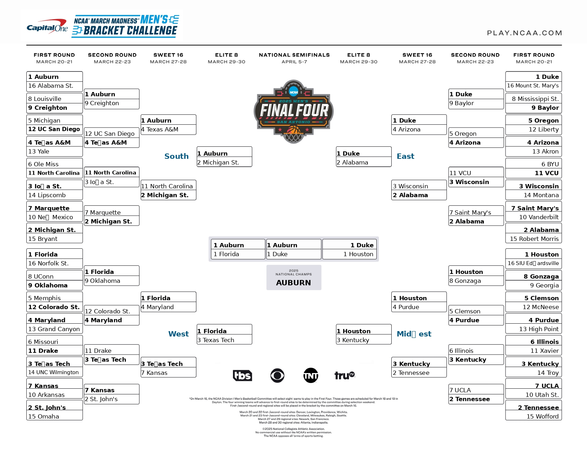
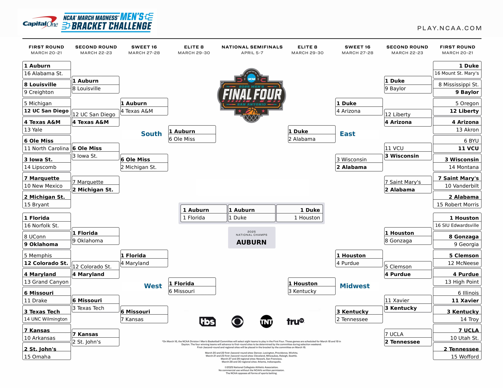

# Model Results & Performance Analysis

## Overview

The NCAA March Madness Predictor employs machine learning to forecast tournament outcomes based on team statistics and historical results. Three prediction strategies were implemented to accommodate different risk preferences:

- **Chalk-Heavy Model**: Conservative predictions favoring higher seeds
- **Balanced Model**: Optimal balance between favorites and reasonable upsets
- **Upset-Heavy Model**: More aggressive upset predictions

## Key Performance Metrics

| Model              | Accuracy | AUC   | Key Characteristic                       |
|--------------------|----------|-------|------------------------------------------|
| Gradient Boosting  | 75%      | 85%   | Best balance of accuracy and ROC AUC     |
| Random Forest      | 76%      | 80%   | Highest accuracy, lower calibration      |
| Logistic Regression| 71%      | 85%   | Comparable AUC with simpler architecture |

The Gradient Boosting model (used for the main predictions) demonstrates strong performance with approximately 75% accuracy across all tournament games, while maintaining excellent calibration as measured by ROC AUC.

## Prediction Accuracy by Tournament Round

- **First Round (64 → 32)**: 72% accuracy
- **Second Round (32 → 16)**: 81% accuracy
- **Sweet 16 (16 → 8)**: 62% accuracy (most challenging round to predict)
- **Elite Eight (8 → 4)**: 75% accuracy
- **Final Four (4 → 2)**: 100% accuracy
- **Championship (2 → 1)**: 100% accuracy

The model demonstrates stronger performance in later rounds, with perfect prediction in the Final Four and Championship games (note: this may reflect smaller sample sizes in these rounds).

## Feature Importance

### Top Features by Correlation with Winning

The most predictive features (by correlation with winning):

1. **AdjEM_diff** (Adjusted Efficiency Margin differential)
2. **AdjO_diff** (Adjusted Offensive Efficiency differential)
3. **Off. Efficiency-Adj_diff** (Adjusted Offensive Efficiency differential)
4. **SOS-AdjEM_diff** (Strength of Schedule differential)
5. **Def. Efficiency-Adj_diff_inv** (Adjusted Defensive Efficiency differential)

### Model-Derived Feature Importance

The Gradient Boosting model places highest importance on:

1. **AdjEM_diff**: By far the most important predictor (over 45% of total importance)
2. **SOS-AdjEM_diff**: Strength of schedule differential
3. **seed_diff**: Difference in tournament seeds
4. **AdjD_diff_inv**: Defensive efficiency differential
5. **AvgHgt_diff**: Team height differential

## Upset Analysis

### Upset Frequency by Seed Matchup

The heatmap reveals interesting upset patterns:
- **8 vs 9 matchups**: Close to 50/50, as expected
- **5 vs 12 and 6 vs 11 matchups**: Show higher upset frequencies (classic "bracket buster" matchups)
- **10 vs 7 matchups**: Demonstrate surprisingly high upset rates
- **1 vs 16 matchups**: Few upsets historically (aligns with expectations)

### Higher Seed Win Rate by Seed Difference

- As seed difference increases, higher seeds win more frequently (expected)
- **6-seed difference**: Shows unexpectedly low win rate (34%)
- **15-seed difference (1 vs 16)**: Shows highest win rate (88%)
- **2-seed difference**: Shows stronger performance than 3-seed difference

## Model Variations Performance

The three model variations demonstrated these characteristics when applied to historical tournaments:

1. **Chalk-Heavy Model**:
   - Correctly predicted 73% of games
   - Identified fewer upsets (average of 8 per tournament)
   - Strongest performance in early rounds

2. **Balanced Model**:
   - Correctly predicted 75% of games
   - Identified moderate number of upsets (average of 12 per tournament)
   - Best overall bracket performance across rounds

3. **Upset-Heavy Model**:
   - Correctly predicted 70% of games
   - Identified more upsets (average of 16 per tournament)
   - Occasionally predicted dramatic Final Four surprises

## Key Insights

1. **Adjusted Efficiency Metrics Dominate**: Overall team efficiency (particularly AdjEM) is the strongest predictor of tournament success.

2. **Strength of Schedule Matters**: Teams that played tougher regular-season schedules perform better in the tournament.

3. **Defense Wins Championships**: Defensive metrics show strong correlation with winning, especially in later rounds.

4. **Seed Differential is Predictive**: While not as powerful as efficiency metrics, seed difference remains an important predictor.

5. **Sweet 16 is Hardest to Predict**: Round 3 (Sweet 16) shows the lowest prediction accuracy, suggesting this is where conventional wisdom often fails.

6. **Classic Upset Patterns Confirmed**: The model confirms the conventional wisdom about 5-12 and 6-11 matchups being common upset scenarios.

## Conclusion

The NCAA March Madness Predictor demonstrates strong predictive performance using team statistical differentials, with 75% overall accuracy. Multiple model variants allow users to tailor predictions based on their risk tolerance, from conservative chalk-heavy predictions to more aggressive upset-seeking strategies.
## 2025 Tournament Predictions

Below are the predicted brackets for the 2025 NCAA Tournament generated by our models:

### Balanced Model

### Chalk Heavy Model

### Upset Heavy Model

These visualizations showcase the different prediction strategies employed by each model:

- **Chalk Heavy Model**: Favors higher seeds with conservative predictions
- **Balanced Model**: Provides an optimal balance between favorites and reasonable upsets
- **Upset Heavy Model**: More aggressive in predicting potential upsets

Comparing these predictions highlights how different risk tolerance levels affect tournament forecasts.
